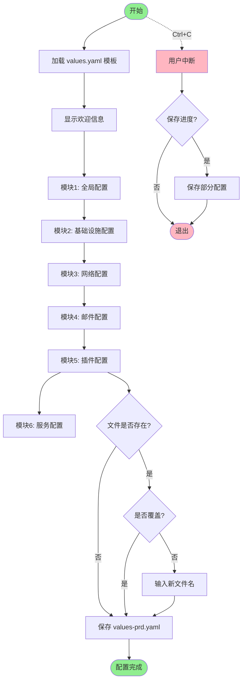
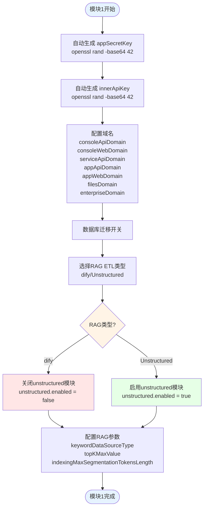
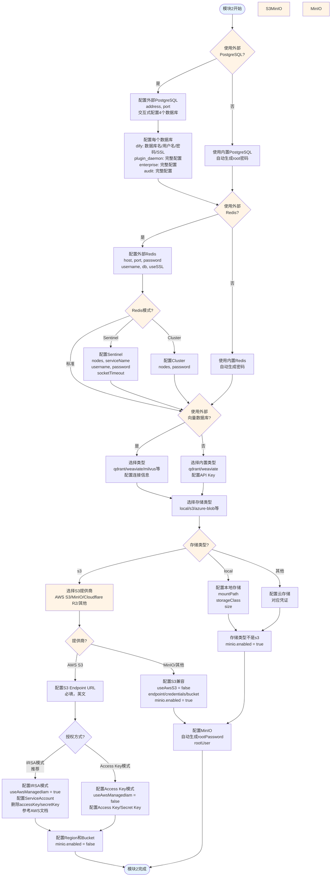
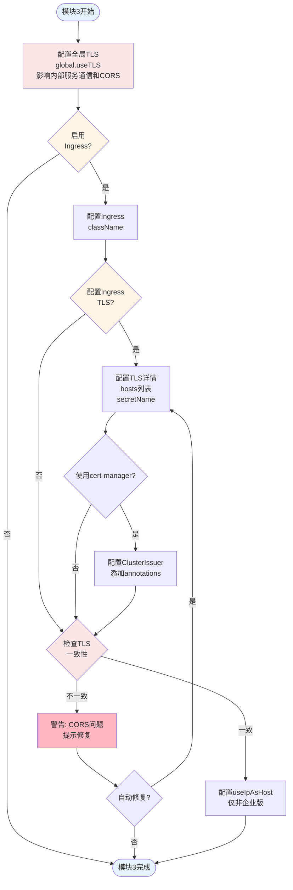
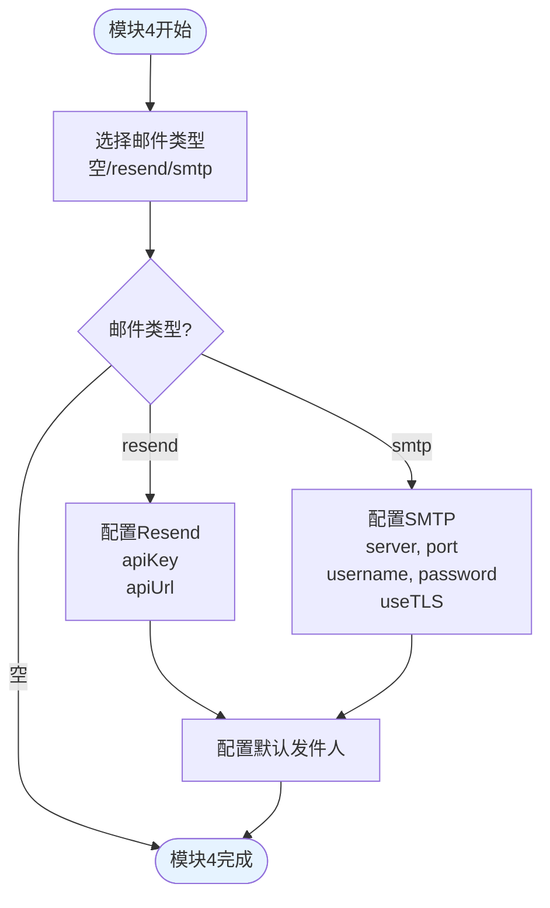
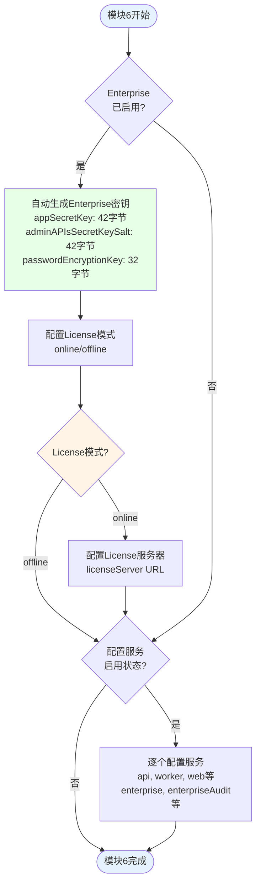
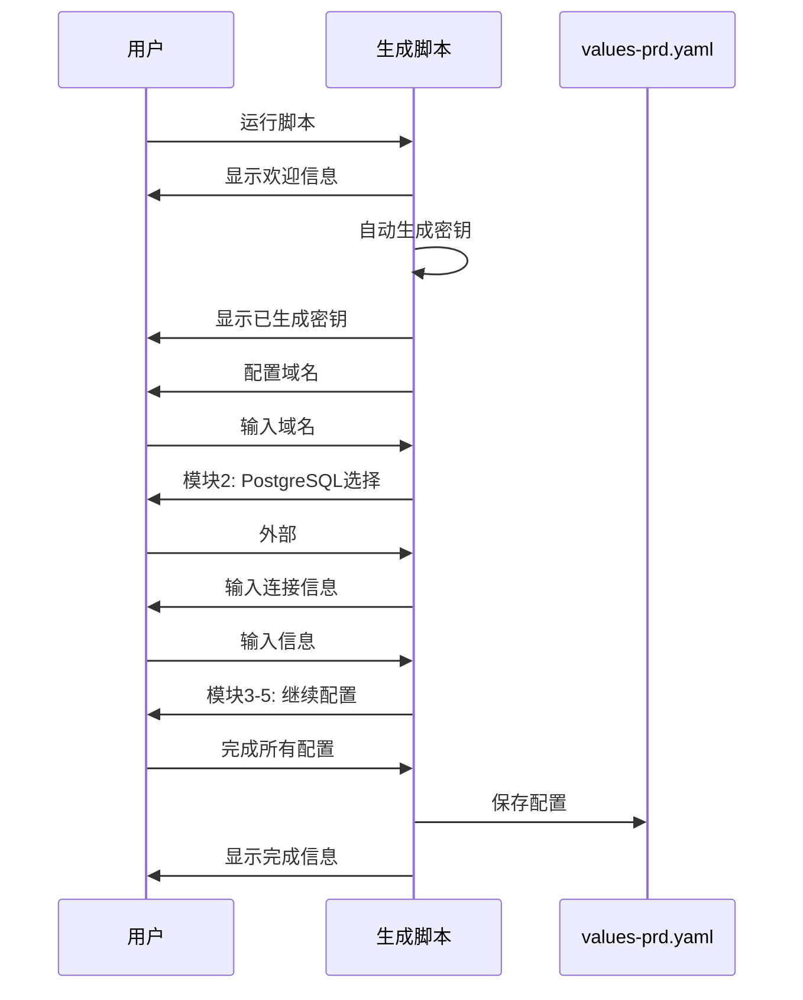

# Dify EE（企业版）Helm Chart Values 生成器流程图

## 主流程图

## 模块1: 全局配置流程图

## 模块2: 基础设施配置流程图

## 模块3: 网络配置流程图

## 模块4: 邮件配置流程图

## 模块5: 插件配置流程图

```mermaid
flowchart TD
    Start([模块5开始]) --> RepoType[选择镜像仓库类型<br/>docker/ecr]
    
    RepoType --> TypeCheck{仓库类型?}
    
    TypeCheck -->|docker| DockerPrefix[配置镜像仓库前缀<br/>docker.io/your-image-repo-prefix]
    TypeCheck -->|ecr| ECRRegion[配置ECR区域<br/>us-east-1等]
    
    ECRRegion --> ECRAccount[配置ECR账户ID<br/>AWS Account ID]
    
    ECRAccount --> ECRPrefix["配置镜像仓库前缀<br/>&#123;account_id&#125;.dkr.ecr.&#123;region&#125;.amazonaws.com/&#123;prefix&#125;"]
    
    ECRPrefix --> AuthMethod{ECR鉴权方式?}
    DockerPrefix --> DockerSecret[配置imageRepoSecret<br/>参考容器镜像仓库文档]
    
    AuthMethod -->|IRSA模式| IRSAServiceAccount[配置ServiceAccount<br/>customServiceAccount<br/>runnerServiceAccount]
    AuthMethod -->|K8s Secret| ECRSecret[配置imageRepoSecret<br/>参考AWS文档]
    
    IRSAServiceAccount --> Protocol
    ECRSecret --> Protocol
    DockerSecret --> Protocol
    
    Protocol[选择协议类型<br/>HTTPS推荐/HTTP不推荐] --> End([模块5完成])
    
    style Start fill:#E6F3FF
    style End fill:#E6F3FF
    style TypeCheck fill:#FFF4E6
    style AuthMethod fill:#FFF4E6
    style Protocol fill:#FFE6E6
```

## 模块6: 服务配置流程图

## 完整交互流程图

```mermaid
flowchart TD
    Start([脚本启动]) --> Init[初始化ValuesGenerator]
    Init --> LoadYAML[加载values.yaml模板]
    LoadYAML --> MainFlow[主流程开始]
    
    MainFlow --> M1[模块1: 全局配置]
    M1 --> M1Q2[自动生成密钥]
    M1Q2 --> M1Q3[配置域名]
    M1Q3 --> M1Q4[配置RAG]
    
    M1Q4 --> M2[模块2: 基础设施]
    M2 --> M2Q1{PostgreSQL选择}
    M2Q1 -->|外部| M2Q1A[配置外部连接]
    M2Q1 -->|内置| M2Q1B[配置内置密码]
    
    M2Q1A --> M2Q2
    M2Q1B --> M2Q2{Redis选择}
    M2Q2 -->|外部| M2Q2A[配置外部连接]
    M2Q2 -->|内置| M2Q2B[配置内置密码]
    
    M2Q2A --> M2Q3
    M2Q2B --> M2Q3{VectorDB选择}
    M2Q3 -->|外部| M2Q3A[配置外部连接]
    M2Q3 -->|内置| M2Q3B[配置内置]
    
    M2Q3A --> M2Q4
    M2Q3B --> M2Q4{存储类型}
    M2Q4 --> M2Q4A[配置存储]
    M2Q4A --> M2Q5{配置MinIO?}
    M2Q5 --> M3
    
    M3[模块3: 网络] --> M3Q1{启用Ingress?}
    M3Q1 --> M4
    
    M4[模块4: 邮件] --> M4Q1{邮件类型}
    M4Q1 --> M5
    
    M5[模块5: 插件] --> M5Q1{镜像仓库类型}
    M5Q1 -->|docker| M5Q1A[配置Docker]
    M5Q1 -->|ecr| M5Q1B[配置ECR]
    M5Q1A --> M5Q2{鉴权方式}
    M5Q1B --> M5Q2{鉴权方式}
    M5Q2 --> M6
    
    M6[模块6: 服务] --> M6Q1{Enterprise配置}
    M6Q1 --> M6Q2{服务状态}
    M6Q2 --> Save
    
    Save[保存文件] --> Validate[验证配置]
    Validate --> Success([完成])
    
    Start -.->|异常| Error[错误处理]
    Error --> Exit([退出])
    
    style Start fill:#90EE90
    style Success fill:#90EE90
    style Error fill:#FFB6C1
    style Exit fill:#FFB6C1
```

## 决策点说明

### 关键决策点

1. **PostgreSQL选择** (互斥)
   - 外部: `externalPostgres.enabled = true`
   - 内置: `postgresql.enabled = true`

2. **Redis选择** (互斥)
   - 外部: `externalRedis.enabled = true`
   - 内置: `redis.enabled = true`

3. **VectorDB选择** (互斥)
   - 外部: `vectorDB.useExternal = true`
   - 内置: `qdrant.enabled` 或 `weaviate.enabled = true`

4. **存储类型** (单选)
   - local, s3, azure-blob, aliyun-oss, google-storage, tencent-cos, volcengine-tos, huawei-obs

5. **邮件类型** (单选)
   - 空(不配置), resend, smtp

### 联动关系

- **存储类型 → MinIO**: 如果 `persistence.type != "s3"`，需要配置MinIO
- **外部服务 → 连接信息**: 选择外部服务后，必须配置对应的连接信息
- **Enterprise → License**: Enterprise服务需要License配置

## 使用示例流程

