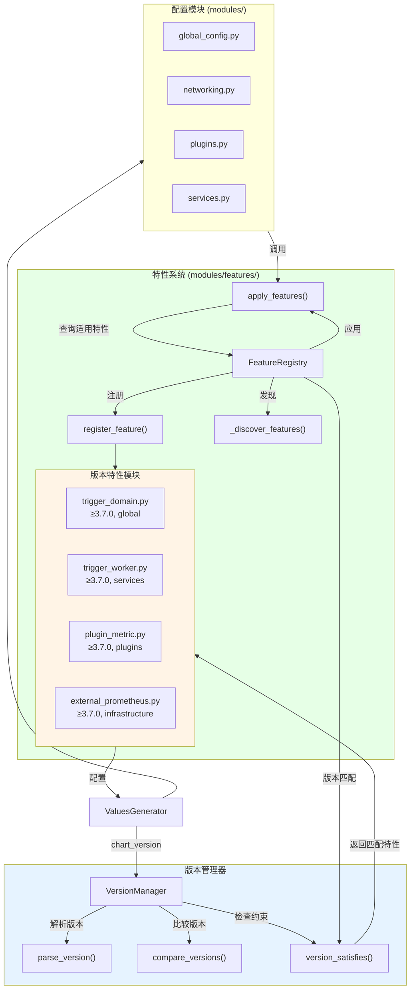
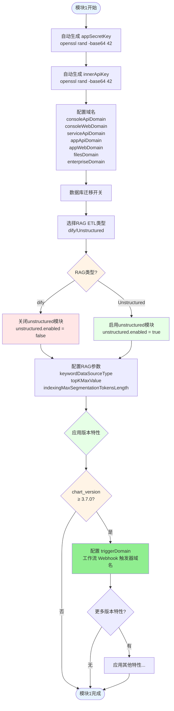

# Dify EE（企业版）Helm Chart Values 生成器流程图

## 版本特性架构（Feature-based Architecture）

从 3.7.0 版本开始，我们采用了 **特性驱动 + 版本检测** 的混合架构来处理不同版本之间的配置差异。

### 架构图



### 目录结构

```
modules/
├── __init__.py
├── global_config.py          # 核心配置（所有版本通用）
├── infrastructure.py
├── networking.py
├── mail.py
├── plugins.py
├── services.py
└── features/                  # 版本特定特性
    ├── __init__.py           # 自动发现机制
    ├── base.py               # Feature基类、注册器、版本比较
    ├── trigger_domain.py     # 3.7.0+ triggerDomain 配置
    ├── trigger_worker.py     # 3.7.0+ triggerWorker 服务
    ├── plugin_metric.py      # 3.7.0+ 插件指标监控
    └── external_prometheus.py # 3.7.0+ 外部 Prometheus
```

### 工作原理

1. **启动时自动发现**：`modules/features/__init__.py` 自动扫描并导入所有特性模块
2. **装饰器注册**：每个特性使用 `@register_feature()` 装饰器声明版本约束
3. **配置时应用**：各模块末尾调用 `apply_features(generator, "module_name")`
4. **版本过滤**：只有满足版本约束的特性才会被执行

### 添加新特性示例

```python
# modules/features/new_feature.py
from .base import Feature, register_feature
from utils import print_section, prompt
from i18n import get_translator

@register_feature(
    min_version="3.8.0",      # 最小版本（含）
    max_version=None,          # 最大版本（含），None表示无上限
    module="global",           # 所属模块
    name="New Feature",
    description="Description of the feature"
)
class NewFeature(Feature):
    def configure(self, generator) -> None:
        _t = get_translator()
        # 配置逻辑...
        generator.values['global']['newField'] = "value"
```

### 版本比较规则

```
3.6.0-alpha.1 < 3.6.0-beta.1 < 3.6.0-rc.1 < 3.6.0 < 3.7.0
```

- 预发布版本（alpha < beta < rc）优先级低于正式版本
- 支持语义化版本比较

---

## 主流程图


## 模块1: 全局配置流程图



## 模块2: 基础设施配置流程图


## 模块3: 网络配置流程图


## 模块4: 邮件配置流程图


## 模块5: 插件配置流程图


## 模块6: 服务配置流程图


## 完整交互流程图


## 决策点说明

### 版本特性对照表

| 特性名称 | 最低版本 | 所属模块 | 说明 |
|---------|---------|---------|------|
| `triggerDomain` | 3.7.0 | global | 工作流 Webhook 触发器域名配置 |
| `triggerWorker` | 3.7.0 | services | Trigger Worker 服务配置（副本数、Celery、代码限制） |
| `plugin_manager.metric` | 3.7.0 | plugins | 插件资源监控配置（CPU、内存、网络 I/O） |
| `externalPrometheus` | 3.7.0 | infrastructure | 外部 Prometheus 配置（用于插件指标监控） |
| `ssrfProxy.sandboxHost` | 3.6.x | infrastructure (高级选项) | 自定义 sandbox 主机 FQDN（用于跨命名空间部署） |

### 关键决策点

1. **PostgreSQL选择** (互斥)
   - 外部: `externalPostgres.enabled = true`
   - 内置: `postgresql.enabled = true`

2. **Redis选择** (互斥)
   - 外部: `externalRedis.enabled = true`
   - 内置: `redis.enabled = true`

3. **VectorDB选择** (互斥)
   - 外部: `vectorDB.useExternal = true`
   - 内置: `qdrant.enabled` 或 `weaviate.enabled = true`

4. **存储类型** (单选)
   - local, s3, azure-blob, aliyun-oss, google-storage, tencent-cos, volcengine-tos, huawei-obs

5. **邮件类型** (单选)
   - 空(不配置), resend, smtp

### 联动关系

- **存储类型 → MinIO**: 如果 `persistence.type != "s3"`，需要配置MinIO
- **外部服务 → 连接信息**: 选择外部服务后，必须配置对应的连接信息
- **Enterprise → License**: Enterprise服务需要License配置

## 使用示例流程


